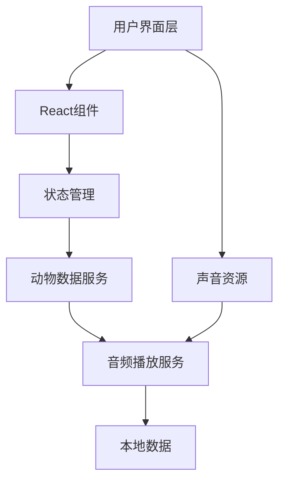

# 儿童动物认知应用 - 技术架构文档

## 1. 架构设计



## 2. 技术栈

- **前端框架**：React@18 + Vite
- **样式方案**：Tailwind CSS + CSS变量
- **状态管理**：React useState/useContext
- **音频播放**：Web Audio API + HTML5 Audio
- **构建工具**：Vite
- **打包方案**：Capacitor（Android APK）
- **CI/CD**：GitHub Actions

## 3. 目录结构

```
animal-learning-app/
├── src/
│   ├── components/
│   │   ├── Home/
│   │   │   └── HomePage.jsx
│   │   ├── Animals/
│   │   │   ├── AnimalsPage.jsx
│   │   │   ├── AnimalCard.jsx
│   │   │   └── AnimalModal.jsx
│   │   └── Layout/
│   │       └── MainLayout.jsx
│   ├── data/
│   │   └── animals.js
│   ├── services/
│   │   └── audioService.js
│   ├── App.jsx
│   ├── main.jsx
│   └── index.css
├── public/
│   └── sounds/
├── capacitor.config.ts
└── package.json
```

## 4. 路由定义

| 路由 | 组件 | 用途 |
|------|------|------|
| `/` | HomePage | 首页，功能入口 |
| `/animals` | AnimalsPage | 认识动物主页面 |
| `/animals/:category` | AnimalsPage | 按分类显示动物 |

## 5. 组件设计

### HomePage 组件
- Logo显示区
- 应用标题
- 功能入口卡片（跳转至/animals）

### AnimalsPage 组件
- 分类标签栏（农场/动物园/海洋馆）
- 动物卡片网格（2列布局）
- 分类切换时显示对应动物列表

### AnimalCard 组件
- Props: `{ animal, onClick }`
- 显示动物图片和名称
- 点击事件回调

### AnimalModal 组件
- 全屏模态框
- 大图展示
- 语音播放："[动物名]怎么叫"
- 动物叫声播放

## 6. 数据模型

### Animal 数据结构
```typescript
interface Animal {
  id: string;
  name: string;           // 中文名
  category: 'farm' | 'zoo' | 'ocean';  // 分类
  image: string;          // 图片URL
  sound: string;          // 叫声音频URL
  emoji: string;          // emoji图标
}
```

### 分类常量
```typescript
const CATEGORIES = {
  farm: { label: '农场', icon: '🐔' },
  zoo: { label: '动物园', icon: '🦁' },
  ocean: { label: '海洋馆', icon: '🐬' }
};
```

## 7. 音频服务

### 音频资源
- 使用免费的动物叫声资源
- 语音合成：使用Web Speech API生成中文语音
- 备用方案：预录音频文件

### 播放逻辑
1. 用户点击动物卡片
2. 延迟100ms播放中文语音："[动物名]怎么叫"
3. 语音播放完毕后立即播放动物叫声
4. 动画效果配合音频播放

## 8. GitHub Actions 配置

### 构建流程
```yaml
触发条件: push到main分支或PR合并
步骤:
  1. 检出代码
  2. 安装Node.js
  3. 安装依赖
  4. 构建Web应用
  5. 同步到Capacitor
  6. 构建Android APK
  7. 上传APK工件
```

### 部署目标
- Android APK包
- 输出目录：`/platforms/android/app/build/outputs/apk/`

## 9. 性能优化

- 图片懒加载
- 音频预加载
- React.memo优化卡片渲染
- CSS动画优先于JS动画
